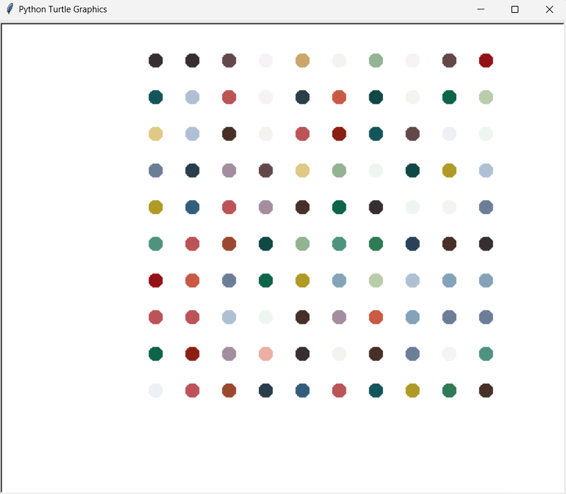

# 🎨 Hirst Painting Generator

A dynamic Python program that emulates the iconic dot style artworks of British artist Damien Hirst using the Turtle graphics module. This project procedurally generates a colorful grid of dots, creating a vibrant digital painting every time it runs.

---

## 🧩 Overview

This project is a creative exploration of Python's graphical capabilities through the `turtle` module. The script generates a 10x10 grid of randomly colored dots, simulating the aesthetic of Damien Hirst's spot paintings. The colors are sampled from a curated palette to give a realistic and visually appealing look. 

It demonstrates core programming concepts including modular design, loops, randomization, coordinate transformations, and color manipulation all wrapped in a clean and reusable Python implementation.

This project was built as part of a comprehensive Python learning journey through **"100 Days of Code: The Complete Python Pro Bootcamp"** by **Dr. Angela Yu**, to solidify understanding of fundamental programming concepts, modular coding practices, and graphical output handling.

---

## 🛠 Technologies & Concepts Used

- **Python 3.11+**: Core programming language used for logic implementation.
- **Turtle Graphics Module**: Python's built in module for GUI based drawing and visual output.
- **RGB Color Manipulation**: The script utilizes the `colormode(255)` configuration to work with 24 bit RGB values.
- **Random Module**: Provides randomness to color selection, creating a unique painting every time the program is executed.
- **Coordinate Geometry**: The turtle’s motion is controlled using angular and directional logic to navigate a 2D plane for structured output.
- **Pen Control**: Techniques such as `penup()`, `dot()`, and `setheading()` are used to control drawing behavior precisely without connecting lines.
- **Environment Variable Configuration**: For Windows systems, the script ensures proper `TCL` and `TK` bindings by explicitly setting environment variables when using `tkinter` based libraries.

---

## 🎮 Program Logic

1. **Setup & Configuration**:
   - The script starts by importing required modules (`turtle`, `random`, and `os`) and setting up the `colormode` to support RGB color inputs.
   - It configures the environment paths for `TCL` and `TK` to ensure smooth execution in Windows environments using `tkinter`.

2. **Turtle Initialization**:
   - A turtle object (`timmy_the_turtle`) is created and customized to hide the cursor, disable drawing lines (`penup()`), and maximize rendering speed (`speed("fastest")`).

3. **Starting Position**:
   - The turtle is placed diagonally down left using a `setheading(225)` and `forward(250)` to begin drawing from the lower left corner of the canvas.

4. **Color Palette**:
   - A curated list of RGB color tuples is used to provide a rich set of contrasting and complementary tones to mimic real life painted dot aesthetics.

5. **Grid Drawing Algorithm**:
   - A loop runs 100 times to generate a 10x10 dot matrix.
   - For each iteration:
     - A dot of fixed size (20px) is stamped with a randomly chosen color.
     - The turtle moves forward by 50px to place the next dot.
     - Every 10th dot signals a row change: the turtle moves up and resets its horizontal alignment.

6. **Termination**:
   - The screen waits for a user click (`exitonclick()`) before closing, allowing the user to view the final generated artwork.

---

## 📁 Project Structure

```
hirst-painting/
    ├── main.py     # Core script for generating the painting
    └── README.md   # Project documentation
```

---

### 🚀 How to Run

> ⚠️ Ensure you have **Python 3.10+** installed.

### Prerequisites
- Python 3.10 or above
- Compatible terminal or IDE (e.g., VS Code, PyCharm)

1. Install the required dependencies (if not already present):
   ```bash
   pip install turtle
   ```

2. **Clone the repository**
   ```bash
   git clone https://github.com/your-username/hirst-painting.git
   ```

3. **Navigate to the project folder**
   ```bash
   cd hirst-painting
   ```

> 💡 **Optional – Windows Only:** If you encounter errors related to `TCL_LIBRARY` or `TK_LIBRARY`, ensure that your Python installation's Tcl paths are correctly set using `os.environ` at the beginning of your script:
   ```bash
   import os
   os.environ['TCL_LIBRARY'] = r'C:\Program Files\Python313\tcl\tcl8.6'
   os.environ['TK_LIBRARY'] = r'C:\Program Files\Python313\tcl\tk8.6'
   ```

4. **Run the script**
   ```bash
   python main.py
   ```

---

## 🖼 Sample Output

The program produces a colorful grid of randomly selected dots inspired by Damien Hirst's spot paintings. Each dot is drawn with a distinct RGB color from a pre defined palette, creating a vibrant piece of generative art.

Here is an example of the output:

<p align="center">
  
</p>

> 📝 *Note: Actual output may vary with each run due to the random color selection mechanism.*

---

## 🔑 Key Highlights

- 🎨 **Dynamic Artwork Creation:** Programmatically generates unique Hirst style dot paintings with vibrant randomized color palettes.
- 🐢 **Turtle Graphics Power:** Leverages Python’s `turtle` module to create pixel perfect grid based patterns on screen.
- 🎲 **Color Randomization:** Utilizes a custom palette extracted from real artwork using `colorgram.py` to ensure authenticity.
- ⚙️ **Customizable Canvas:** Easily tweak grid size, spacing, and color range for personalized visual outputs.
- 📁 **Clean Code Architecture:** Modular, scalable design with separated logic for clarity and maintainability.
- 🧪 **Test Friendly Logic:** Written in a readable, structured manner that encourages experimentation and learning.

---

## 🎓 Credits

- 👩‍🏫 **Dr. Angela Yu** — This project was inspired and guided by the *"100 Days of Code: The Complete Python Pro Bootcamp"* by Dr. Angela Yu, a comprehensive and beginner friendly Python course that blends core concepts with hands on projects.
- 🐍 **Python Community** — Thanks to the open source contributors and Python educators whose tutorials, libraries, and documentation foster accessible programming education.
- 🎨 **Damien Hirst** — The concept of dot style abstract art is inspired by the legendary British artist Damien Hirst, known for his vibrant spot paintings that influenced this visual output.
- 💻 **You** — Whether you're a student, hobbyist, or professional, your curiosity and willingness to explore creative code is what keeps the open source spirit alive.

> 🙏 Special thanks to the developers and designers around the globe whose passion fuels the intersection of art and technology.

---